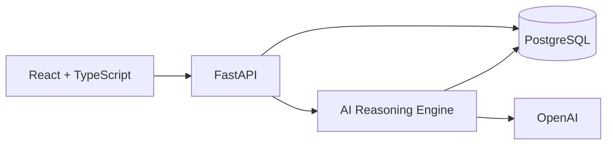
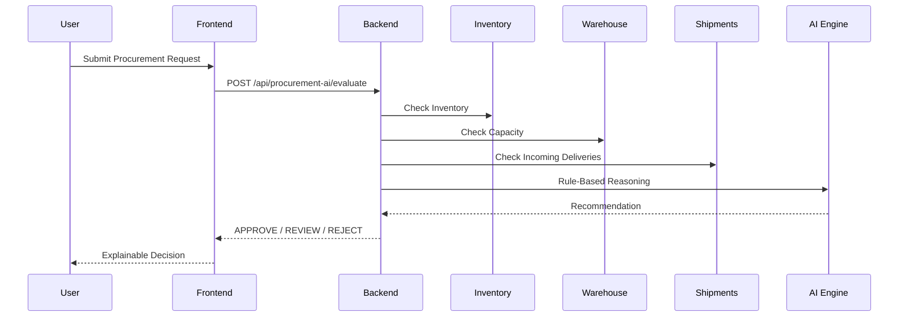

# 💊 PharmaChain – AI Clinical Supply Chain Copilot

> Enterprise AI-powered Clinical Supply Chain Platform built with **FastAPI, React, PostgreSQL, and OpenAI**.

PharmaChain is a production-oriented AI platform that helps pharmaceutical warehouses and procurement teams make explainable, data-driven decisions across inventory, warehouse operations, suppliers, shipments, and procurement.

It demonstrates enterprise backend engineering, AI orchestration, secure authentication, and modern full-stack software development.

---

# 🚀 Live Demo

🌐 **Frontend:** https://pharma-chain-ai-clinical-supply-cha.vercel.app

⚙️ **Backend API (Swagger):**
https://pharmachain-backend.onrender.com/docs

> **Demo access:** Available upon request.

---

# 📸 Screenshots

| Login | Dashboard |
|--------|-----------|
| *(Add screenshot)* | *(Add screenshot)* |

| Inventory | AI Procurement |
|------------|----------------|
| *(Add screenshot)* | *(Add screenshot)* |

| Executive Copilot | Warehouse |
|-------------------|-----------|
| *(Add screenshot)* | *(Add screenshot)* |

---

# ✨ Key Features

## 🔐 Enterprise Security

- JWT Authentication
- Refresh Token Rotation
- Role-Based Access Control (RBAC)
- Permission-based Authorization
- Audit Logging

---

## 🤖 AI Capabilities

- AI Procurement Copilot
- Executive AI Copilot
- Explainable AI Decisions
- Multi-tool Reasoning Engine
- Planning Strategy
- Intent Detection
- Tool Orchestration
- Structured AI Responses

---

## 📦 Supply Chain Modules

- Products
- Suppliers
- Inventory
- Warehouse Capacity
- Shipments
- Procurement
- Dashboard Analytics

---

## ⚙️ Engineering Features

- Clean Architecture
- Repository-Service Pattern
- Dependency Injection
- SQLAlchemy ORM
- Alembic Migrations
- Swagger/OpenAPI
- Docker
- Docker Compose
- GitHub Actions CI/CD
- Pytest
- Enterprise Logging

---

# 🏗 Architecture



---

# 🧠 AI Procurement Workflow



---

# 🛠 Tech Stack

| Layer | Technologies |
|--------|--------------|
| Backend | Python, FastAPI, SQLAlchemy, Alembic |
| Frontend | React, TypeScript, Tailwind CSS |
| Database | PostgreSQL |
| AI | OpenAI, Rule-Based AI, Tool Orchestration |
| Security | JWT, RBAC, Password Hashing |
| DevOps | Docker, GitHub Actions, Render, Vercel |
| Testing | Pytest |
| Documentation | Swagger, Mermaid |

---

# 🚀 Production Status

| Feature | Status |
|----------|--------|
| Frontend Deployment | ✅ |
| Backend Deployment | ✅ |
| PostgreSQL | ✅ |
| JWT Authentication | ✅ |
| RBAC | ✅ |
| AI Procurement | ✅ |
| Demo Data Seeding | ✅ |
| Dashboard Live API | 🚧 |
| Inventory Live API | 🚧 |
| Warehouse Live API | 🚧 |
| Shipments Live API | 🚧 |

---

# 🧪 Testing

The backend includes unit and integration tests covering:

- Authentication
- RBAC
- Procurement AI
- Repository Layer
- Service Layer
- Seed Data
- API Endpoints

Run locally:

```bash
cd backend
python -m pytest
```

---

# 📂 Project Structure

```text
backend/
    app/
        api/
        services/
        repositories/
        models/
        ai/
        schemas/
        core/

frontend/
    src/
        components/
        routes/
        lib/
        hooks/

.github/
```

---

# 🚀 Getting Started

## Backend

```bash
cd backend

python -m venv .venv

source .venv/bin/activate

pip install -r requirements.txt

uvicorn app.main:app --reload
```

---

## Frontend

```bash
cd frontend

npm install

npm run dev
```

---

# 🔑 Environment Variables

```env
DATABASE_URL=

JWT_SECRET_KEY=

OPENAI_API_KEY=

AZURE_OPENAI_ENDPOINT=

AZURE_OPENAI_API_KEY=
```

Never commit `.env` files or secrets.

---

# 🎯 Engineering Highlights

This project demonstrates:

- Enterprise Backend Engineering
- AI-Oriented Software Design
- Clean Architecture
- Repository-Service Pattern
- SOLID Principles
- Explainable AI
- Enterprise Authentication
- Modern Full Stack Development
- CI/CD
- Docker
- Cloud Deployment
- Production APIs

---

# 🗺 Roadmap

## ✅ Completed

- Authentication
- JWT
- Refresh Tokens
- RBAC
- AI Procurement
- Executive Copilot
- Explainable AI
- Swagger
- PostgreSQL
- Docker
- GitHub Actions
- Production Deployment
- Demo Data Seeding

## 🚧 In Progress

- Dashboard Live Data
- Inventory Live Data
- Warehouse Live Data
- Shipments Live Data

## 🔮 Planned

- LLM Planning
- Conversation Memory
- Human Approval Workflow
- Observability Dashboard
- Multi-Agent Collaboration

---

# 👩‍💻 About Me

**Vibhuti Dhimar**

AI Software Engineer | Python Backend Engineer | Full Stack AI Engineer

📍 Leicester, United Kingdom

🔗 LinkedIn: https://www.linkedin.com/in/vibhuti-dhimar/

💻 GitHub: https://github.com/VDhimar09

🌐 Portfolio: https://vibhuti-ai-platform.vercel.app

---

# ⭐ Why I Built PharmaChain

Pharmaceutical supply chains require secure, explainable, and reliable decision support.

PharmaChain was designed to demonstrate how modern AI can augment—not replace—human decision-making by combining enterprise software engineering with transparent AI reasoning.

The project showcases production-ready backend engineering, full-stack development, secure authentication, and AI-assisted procurement workflows suitable for regulated healthcare environments.

---

# 📄 License

MIT License
