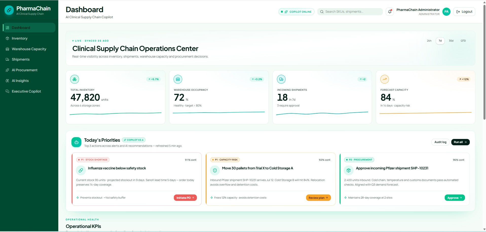
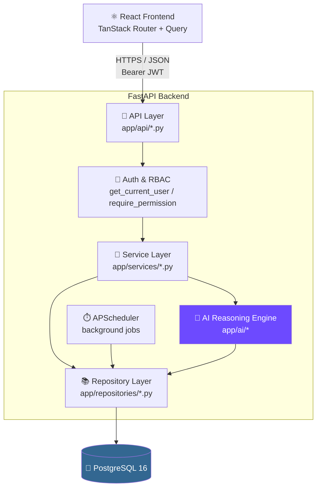
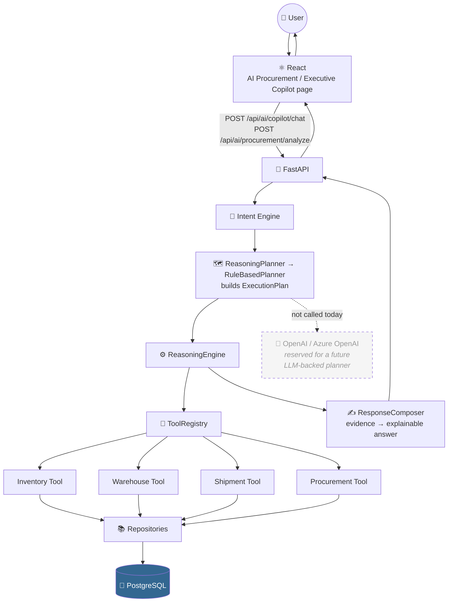
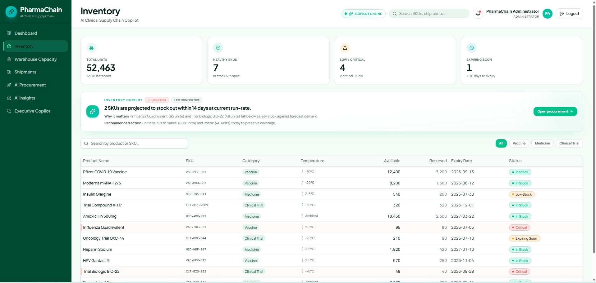
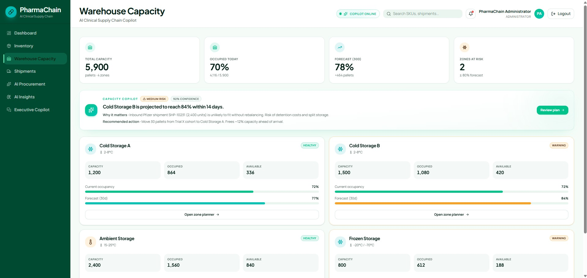
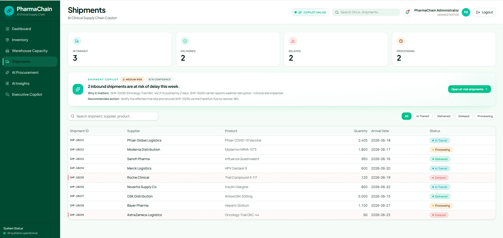
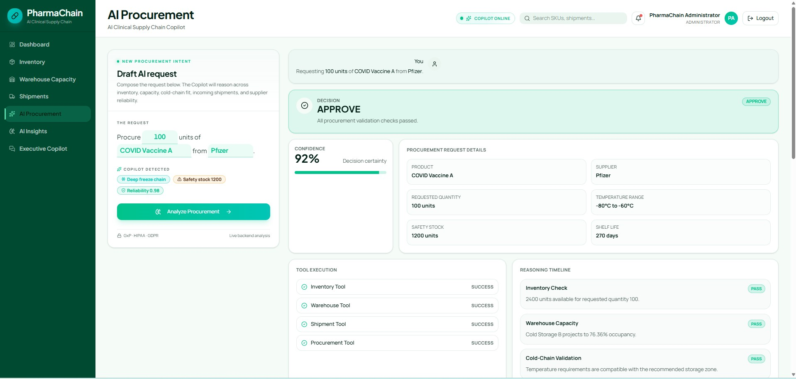
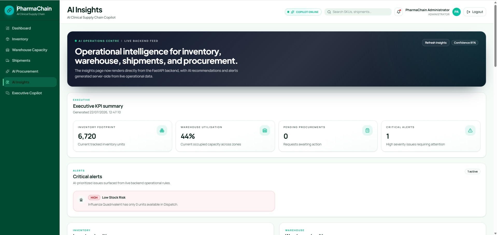
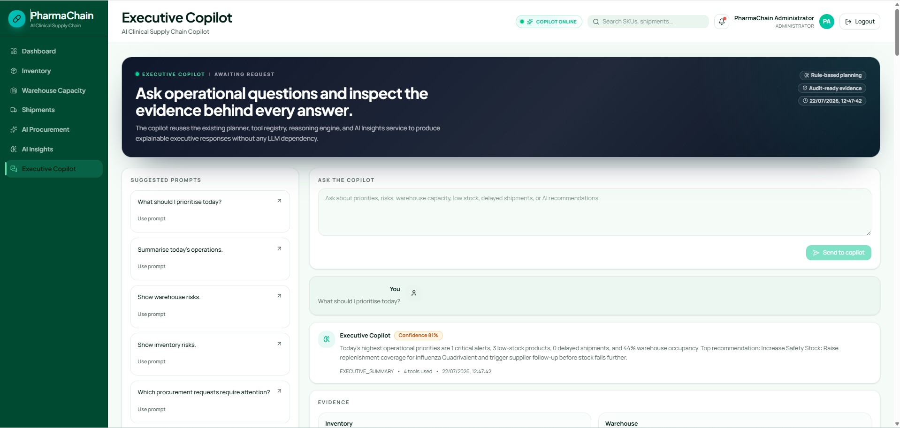

<div align="center">

# 💊 PharmaChain

### AI Clinical Supply Chain Copilot

**An explainable, rule-based AI operations platform for pharmaceutical inventory,<br />warehouse capacity, shipment logistics and procurement decision support.**

[](backend/requirements.txt)
[](backend/requirements.txt)
[](frontend/package.json)
[](frontend/package.json)
[](docker-compose.yml)
[](backend/Dockerfile)
[](LICENSE.txt)



<sub>Executive Dashboard — live operational KPIs served from the FastAPI backend</sub>

</div>

> [!NOTE]
> The AI layer in this project is a **deterministic, rule-based reasoning engine** — not an LLM wrapper. `OPENAI_API_KEY` / `AZURE_OPENAI_*` exist in configuration as **reserved, currently-unused** settings for a future LLM-backed planner. Every claim in this README is verified against the actual codebase.

---

## 📚 Table of Contents

<table>
<tr>
<td valign="top" width="50%">

- [📖 Overview](#-overview)
- [✨ Features](#-features)
- [🏗️ Architecture](#-architecture)
- [🛠️ Technology Stack](#-technology-stack)
- [📂 Folder Structure](#-folder-structure)
- [🔌 API Reference](#-api-reference)

</td>
<td valign="top" width="50%">

- [🔐 Authentication & RBAC](#-authentication--rbac)
- [🚀 Getting Started](#-getting-started)
- [🧪 Testing](#-testing)
- [☁️ Deployment](#-deployment)
- [🗺️ Roadmap](#-roadmap)
- [🖼️ Screenshots](#-screenshots-gallery) · [👩‍💻 About](#-about) · [📄 License](#-license)

</td>
</tr>
</table>

---

## 📖 Overview

Pharmaceutical supply chains carry risk that generic dashboards miss: cold-chain inventory with strict expiry windows, warehouse zones with finite shared capacity, shipment delays that ripple silently into stockouts, and procurement calls made without a consolidated, auditable view of stock, incoming shipments and supplier reliability. **PharmaChain** consolidates inventory, warehouse, shipments and procurement behind one authenticated, role-aware application, and adds an AI layer that reasons over **live** operational data — every KPI, table and chart reads from PostgreSQL through the FastAPI service layer, nothing is hardcoded or simulated.

It's built for operations, warehouse and procurement managers who need one place to see inventory health, warehouse occupancy, shipment risk and an explainable procurement recommendation — and for engineers evaluating a realistic, full-stack, RBAC-secured FastAPI + React reference implementation.

A procurement or capacity decision made without evidence is hard to trust and hard to audit later. PharmaChain's reasoning engine makes every AI answer traceable: detected intent → execution plan → tools run → evidence collected → composed recommendation with a confidence score, all inspectable in the UI rather than hidden behind a black box.

---

## ✨ Features

- **📊 Dashboard** — Executive KPIs (inventory units, warehouse occupancy, incoming/delayed shipments) from `GET /api/dashboard/summary`, plus AI-generated priorities from `GET /api/ai/insights`.
- **📦 Inventory** — Live inventory table and status KPIs (Healthy / Low / Critical / Expiring) from `GET /api/inventory`, with status computed server-side from quantity and expiry date.
- **🏭 Warehouse** — Zone-level capacity and occupancy from `GET /api/warehouse-zones` and `/capacity`. Forecasting isn't implemented server-side, so forecast widgets honestly show **Unavailable** instead of fabricated numbers.
- **🚚 Shipments** — Shipment table and status KPIs (In Transit / Delivered / Delayed / Processing) from `GET /api/shipments`.
- **🤖 AI Procurement** — Compose a request (product, supplier, quantity) and run it through the reasoning engine via `POST /api/ai/procurement/analyze` — returns a decision, confidence score, tool execution trace, reasoning steps and evidence bundle.
- **📈 AI Insights** — A single operations centre — executive KPIs, alerts, inventory/warehouse/shipment/procurement breakdowns, recommendations and trend charts — all from one call to `GET /api/ai/insights`.
- **💬 Executive Copilot** — A conversational interface over the same reasoning engine (`POST /api/ai/copilot/chat`) — ask an operational question, get a structured, explainable answer with its tool execution trace.
- **🔐 Auth & RBAC** — JWT access/refresh tokens and five permission-scoped roles gate every route in the API — see [Authentication & RBAC](#-authentication--rbac).

> All seven modules are pictured together in the [Screenshots Gallery](#-screenshots-gallery).

---

## 🏗️ Architecture

### System Architecture

<div align="center">



</div>

Real backend layering: `api/` (FastAPI routers) → `services/` (business logic) → `repositories/` (data access) → SQLAlchemy models → PostgreSQL. A background APScheduler job (`app/jobs/shipment_monitor.py`) writes to the same repository layer on a schedule.

### AI Reasoning Pipeline

<div align="center">



</div>

This mirrors the pipeline documented in [`backend/docs/architecture.md`](backend/docs/architecture.md): `CopilotTool → ReasoningPlanner → PlanningStrategy → RuleBasedPlanner → ExecutionPlan → ReasoningEngine → ToolRegistry → Tools → ResponseComposer`. The planner is built with the Strategy pattern specifically so an `LLMPlanner` can be substituted later without touching the execution or response layers — but no such planner exists in the codebase today.

Three UI surfaces drive this pipeline directly:

| Page | Endpoint | Service |
|---|---|---|
| `/assistant` — AI Procurement | `POST /api/ai/procurement/analyze` | `ProcurementAnalysisService` |
| `/insights` — AI Insights | `GET /api/ai/insights` | `AIInsightsService` |
| `/copilot` — Executive Copilot | `POST /api/ai/copilot/chat` | `CopilotOrchestratorService` |

None of the three call an external LLM — all three run the same in-process `ReasoningPlanner → RuleBasedPlanner → ReasoningEngine → ToolRegistry` pipeline and return their intent, tool execution trace, evidence and reasoning directly to the UI, so every answer is auditable rather than just readable.

---

## 🛠️ Technology Stack

<table>
<tr><th>Layer</th><th>Technology</th></tr>
<tr>
<td><b>Frontend</b></td>
<td>React 19 · TypeScript 5 · TanStack Router / Start · TanStack Query · Tailwind CSS 4 · Radix UI · Recharts · React Hook Form · Zod · Vite 7</td>
</tr>
<tr>
<td><b>Backend</b></td>
<td>FastAPI · Python 3.13 · SQLAlchemy 2.0 · Alembic · Pydantic 2 · APScheduler</td>
</tr>
<tr>
<td><b>Database</b></td>
<td>PostgreSQL 16 · psycopg2-binary</td>
</tr>
<tr>
<td><b>AI</b></td>
<td>Deterministic rule-based reasoning (Intent Engine → Planner → Tool Registry → Response Composer). <code>OPENAI_API_KEY</code> / <code>AZURE_OPENAI_*</code> reserved, not currently wired into any code path.</td>
</tr>
<tr>
<td><b>Authentication</b></td>
<td>JWT (PyJWT, HS256) access + refresh tokens · passlib + bcrypt password hashing · permission-based RBAC</td>
</tr>
<tr>
<td><b>Deployment</b></td>
<td>Docker (backend), Dockerfile configured for Render; frontend built via Vite/Nitro</td>
</tr>
</table>

---

## 📂 Folder Structure

<details>
<summary><b>Click to expand full repository layout</b></summary>

```text
PharmaChain-AI-Clinical-Supply-Chain-Copilot/
├── backend/
│   ├── app/
│   │   ├── ai/
│   │   │   ├── planner/        # PlannerContext, PlanningStrategy, RuleBasedPlanner, ReasoningPlanner
│   │   │   ├── reasoning/      # ReasoningEngine
│   │   │   ├── response/       # ResponseComposer
│   │   │   └── tools/          # ToolRegistry + Inventory/Warehouse/Shipment/Procurement tools
│   │   ├── api/                 # FastAPI routers (one file per domain)
│   │   ├── core/                 # config, database, security (JWT), logging
│   │   ├── dependencies/        # get_current_user, require_permission, require_role
│   │   ├── jobs/                 # APScheduler background jobs (shipment monitor)
│   │   ├── models/               # SQLAlchemy models
│   │   ├── repositories/        # Data-access layer
│   │   ├── schemas/              # Pydantic request/response schemas
│   │   ├── services/             # Business logic / orchestration
│   │   └── main.py               # App factory, router registration, startup/shutdown
│   ├── alembic/                  # Database migrations
│   ├── tests/                    # pytest suite (17 test modules)
│   ├── docs/architecture.md      # AI reasoning pipeline documentation
│   ├── Dockerfile
│   ├── docker-compose.yml
│   └── requirements.txt
├── frontend/
│   └── src/
│       ├── routes/                # TanStack Router file-based routes (one per page)
│       ├── components/
│       │   ├── copilot/           # Executive Copilot UI
│       │   ├── insights/          # AI Insights UI
│       │   ├── procurement/       # AI Procurement UI
│       │   └── ui/                # Shared Radix/shadcn-style primitives
│       ├── hooks/
│       └── lib/
│           ├── api/               # apiClient, endpoints.ts, React Query hooks.ts
│           └── auth/              # Token storage
├── assets/
│   └── screenshots/               # Product screenshots used in this README
├── docker-compose.yml
└── README.md
```

</details>

---

## 🔌 API Reference

All routes require a valid JWT unless marked **Public**; most also require the listed permission via `require_permission(...)`.

<details open>
<summary><b>Inventory · Warehouse · Shipments</b></summary>

| Method | Endpoint | Description | Permission |
|---|---|---|---|
| `GET` | `/api/inventory/` | List all inventory records | `inventory.read` |
| `GET` | `/api/inventory/statistics` | Aggregate inventory statistics | `inventory.read` |
| `GET` | `/api/inventory/low-stock` | Items at/under safety stock | `inventory.read` |
| `GET` | `/api/inventory/expiring` | Items expiring within 30 days | `inventory.read` |
| `GET` | `/api/inventory/{id}` | Get one inventory record | `inventory.read` |
| `POST` | `/api/inventory/` | Create an inventory record | `inventory.write` |
| `DELETE` | `/api/inventory/{id}` | Delete an inventory record | `inventory.write` |
| `GET` | `/api/warehouse-zones/` | List warehouse zones | `warehouse.read` |
| `GET` | `/api/warehouse-zones/capacity` | Aggregate capacity summary | `warehouse.read` |
| `GET` | `/api/warehouse-zones/{id}` | Get one zone | `warehouse.read` |
| `POST` | `/api/warehouse-zones/` | Create a zone | `warehouse.write` |
| `DELETE` | `/api/warehouse-zones/{id}` | Delete a zone | `warehouse.write` |
| `GET` | `/api/shipments/` | List shipments | `shipment.read` |
| `GET` | `/api/shipments/statistics` | Shipment statistics | `shipment.read` |
| `GET` | `/api/shipments/{id}` | Get one shipment | `shipment.read` |
| `POST` | `/api/shipments/` | Create a shipment | `shipment.write` |
| `DELETE` | `/api/shipments/{id}` | Delete a shipment | `shipment.write` |

</details>

<details>
<summary><b>Products · Suppliers · Procurement</b></summary>

| Method | Endpoint | Description | Permission |
|---|---|---|---|
| `GET` | `/api/products/` | List products | `inventory.read` |
| `POST` | `/api/products/` | Create a product | `inventory.write` |
| `GET` | `/api/suppliers/` | List suppliers | `supplier.read` |
| `POST` | `/api/suppliers/` | Create a supplier | `supplier.write` |
| `GET` | `/api/procurement-requests/` | List procurement requests | `procurement.read` |
| `GET` | `/api/procurement-requests/statistics` | Procurement statistics | `procurement.read` |
| `GET` | `/api/procurement-requests/{id}` | Get one request | `procurement.read` |
| `POST` | `/api/procurement-requests/` | Create a procurement request | `procurement.write` |
| `DELETE` | `/api/procurement-requests/{id}` | Delete a procurement request | `procurement.write` |
| `POST` | `/api/procurement-ai/evaluate` | Rule-based procurement evaluation | `ai.access` |

</details>

<details>
<summary><b>AI, Dashboard, Audit & System</b></summary>

| Method | Endpoint | Description | Permission |
|---|---|---|---|
| `GET` | `/api/ai/insights` | Full AI Insights payload | `insights.view` |
| `POST` | `/api/ai/copilot/chat` | Executive Copilot conversational endpoint | `copilot.use` |
| `POST` | `/api/ai/procurement/analyze` | Deterministic AI procurement analysis with reasoning trace | `ai.access` |
| `GET` | `/api/ai/inventory-summary` | Inventory tool summary (internal/legacy) | `insights.view` |
| `GET` | `/api/ai/low-stock` | Low-stock tool output (internal/legacy) | `insights.view` |
| `GET` | `/api/ai/expiring` | Expiring-products tool output (internal/legacy) | `insights.view` |
| `GET` | `/api/ai/warehouse-capacity` | Warehouse tool capacity summary (internal/legacy) | `insights.view` |
| `GET` | `/api/ai/shipment-summary` | Shipment tool summary (internal/legacy) | `insights.view` |
| `POST` | `/api/chat/` | Alternate chat endpoint (`AIChatService`) | `copilot.use` |
| `GET` | `/api/dashboard/summary` | Executive KPI summary | `insights.view` |
| `GET` | `/api/audit/` | Paginated, filterable audit log query | `audit.read` |
| `GET` | `/api/system/jobs/` | Background scheduler job health | `system.monitor` |
| `GET` | `/` | API welcome message | Public |
| `GET` | `/health` | Health check | Public |
| `GET` | `/docs` | Interactive OpenAPI (Swagger) docs | Public |

</details>

<details>
<summary><b>Authentication</b></summary>

| Method | Endpoint | Description | Access |
|---|---|---|---|
| `POST` | `/api/auth/login` | Authenticate, returns access + refresh tokens | Public |
| `POST` | `/api/auth/refresh` | Exchange refresh token for a new token pair | Public |
| `POST` | `/api/auth/logout` | Revoke a refresh token | Authenticated |
| `GET` | `/api/auth/me` | Current user's profile, role and permissions | Authenticated |

</details>

---

## 🔐 Authentication & RBAC

| Aspect | Detail |
|---|---|
| **JWT** | Login issues a short-lived **access token** and a longer-lived **refresh token**, signed with `PyJWT` (`HS256`). |
| **Refresh tokens** | Persisted server-side (`RefreshToken` model) and individually revocable on logout; default lifetimes are **15 minutes** (access) and **7 days** (refresh), both configurable. |
| **RBAC** | Permission-based — every protected route depends on `require_permission("<permission>")`, and a role is a named bundle of permission strings. `system.admin` is a superuser permission that satisfies every check. |
| **Protected routes** | Every domain router (`inventory`, `warehouse-zones`, `shipments`, `products`, `suppliers`, `procurement-requests`, `ai`, `dashboard`, `audit`, `system/jobs`) is mounted behind `get_current_user`, and each endpoint additionally checks a specific permission. |

<details>
<summary><b>Built-in roles and their permissions</b></summary>

| Role | Permissions |
|---|---|
| **Administrator** | `system.admin` (all), plus every domain read/write/approve permission |
| **Operations Manager** | `inventory.read`, `warehouse.read`, `shipment.read`, `procurement.read`, `insights.view`, `copilot.use` |
| **Warehouse Manager** | `inventory.read`, `inventory.write`, `warehouse.read`, `warehouse.write`, `shipment.read`, `copilot.use` |
| **Procurement Manager** | `supplier.read`, `supplier.write`, `procurement.read`, `procurement.write`, `procurement.approve`, `inventory.read`, `insights.view`, `copilot.use` |
| **Viewer** | `inventory.read`, `warehouse.read`, `shipment.read`, `supplier.read`, `procurement.read`, `insights.view` |

Roles and permissions are seeded automatically on startup by `BootstrapService`, along with a default administrator controlled by the `BOOTSTRAP_ADMIN_*` environment variables.

</details>

---

## 🚀 Getting Started

### Clone

```bash
git clone https://github.com/VDhimar09/PharmaChain-AI-Clinical-Supply-Chain-Copilot.git
cd PharmaChain-AI-Clinical-Supply-Chain-Copilot
```

### Backend

```bash
cd backend
python -m venv .venv
.venv\Scripts\activate        # Windows
# source .venv/bin/activate   # macOS / Linux

pip install -r requirements.txt
uvicorn app.main:app --reload
```

On startup, the backend automatically creates tables, seeds RBAC roles/permissions, creates a bootstrap administrator, and seeds demo data — no manual database setup required beyond a running PostgreSQL instance.

### Frontend

```bash
cd frontend
npm install
npm run dev
```

### Environment Variables

<details>
<summary><b><code>backend/.env</code></b></summary>

| Variable | Default | Description |
|---|---|---|
| `DATABASE_URL` | — (required) | PostgreSQL connection string |
| `JWT_SECRET_KEY` | `change-me-in-production` | JWT signing secret |
| `JWT_ALGORITHM` | `HS256` | JWT signing algorithm |
| `ACCESS_TOKEN_EXPIRE_MINUTES` | `15` | Access token lifetime |
| `REFRESH_TOKEN_EXPIRE_DAYS` | `7` | Refresh token lifetime |
| `JWT_ISSUER` | `pharmachain-api` | JWT issuer claim |
| `BOOTSTRAP_ADMIN_EMAIL` | `admin@pharmachain.com` | Seeded administrator email |
| `BOOTSTRAP_ADMIN_PASSWORD` | `ChangeMe123!` | Seeded administrator password — change before any shared deployment |
| `BOOTSTRAP_ADMIN_NAME` | `PharmaChain Administrator` | Seeded administrator display name |
| `OPENAI_API_KEY` | *(empty)* | Reserved for a future LLM-backed planner — not currently used |
| `AZURE_OPENAI_ENDPOINT` / `AZURE_OPENAI_API_KEY` | *(empty)* | Reserved for a future LLM-backed planner — not currently used |
| `CORS_ORIGINS` | `http://localhost:3000,http://localhost:5173` | Comma-separated allowed origins |
| `ENVIRONMENT` | `development` | Environment label |

</details>

<details>
<summary><b><code>frontend/.env</code></b></summary>

| Variable | Default | Description |
|---|---|---|
| `VITE_API_BASE_URL` | `http://localhost:8000` | Base URL the frontend calls for all `/api/*` requests |

</details>

### Running Locally

| Service | URL |
|---|---|
| Frontend | http://localhost:5173 |
| Backend API | http://localhost:8000 |
| API Docs (Swagger) | http://localhost:8000/docs |

### Docker

```bash
docker compose up --build
```

Starts PostgreSQL 16 and the FastAPI backend (`backend/Dockerfile`). Run the frontend separately with `npm run dev` / `npm run build`.

---

## 🧪 Testing

**Backend** — pytest suite in `backend/tests/` (17 modules), covering authentication, RBAC, audit logging, the AI planner/reasoning engine/tool registry/response composer, procurement AI/analysis services, and background job integration.

```bash
cd backend
pip install -r requirements-dev.txt
pytest
```

**Frontend** — no automated test suite is currently configured (`frontend/package.json` has no `test` script). Verification today is `npm exec tsc --noEmit` + `npm run build`.

---

## ☁️ Deployment

- **Backend** — `backend/Dockerfile` is written for containerized deployment and is explicitly configured for **Render** (reads `$PORT`, installs from `requirements.txt`).
- **Frontend** — built with Vite + TanStack Start on the Nitro server target; `npm run build` produces a deployable server bundle. This repository's default Nitro preset emits a Cloudflare Workers–compatible output.
- No **Vercel** configuration and no CI/CD pipeline (e.g. GitHub Actions) currently exist in this repository — they are not claimed here.

---

## 🗺️ Roadmap

**Completed**

- [x] Full CRUD-backed Inventory, Warehouse Zones, Shipments, Products, Suppliers and Procurement Requests modules
- [x] JWT auth with refresh tokens and five-role, permission-based RBAC
- [x] Deterministic AI reasoning engine — Intent Engine → Planner → Tool Registry → Response Composer
- [x] AI Procurement analysis, AI Insights operations centre and Executive Copilot chat
- [x] Audit logging and background shipment-monitor job (APScheduler)
- [x] Core frontend pages (Dashboard, Inventory, Warehouse, Shipments) migrated from mock data onto live backend endpoints

**Future**

- [ ] LLM-backed planning strategy (`OPENAI_API_KEY` / `AZURE_OPENAI_*` are already reserved for this)
- [ ] Retrieval-Augmented Generation (RAG) over operational documents
- [ ] Redis caching layer
- [ ] CI/CD pipeline (e.g. GitHub Actions)
- [ ] Automated frontend test suite
- [ ] Kubernetes deployment manifests
- [ ] Monitoring & observability beyond the current audit log

---

## 🖼️ Screenshots Gallery

<p align="center">
  
  
</p>
<p align="center">
  
  
</p>
<p align="center">
  
  
</p>
<p align="center">
  
</p>

---

## 👩‍💻 About

<div align="center">

**Vibhuti Dhimar**

AI Software Engineer · Product Engineer · NHS Tech Returner

This project demonstrates full-stack engineering and explainable, rule-based AI system design through a realistic pharmaceutical supply chain platform.

[](https://github.com/VDhimar09)

</div>

---

## 📄 License

<div align="center">

Licensed under the **MIT License** — see [`LICENSE.txt`](LICENSE.txt).

<sub>Built with FastAPI, React, PostgreSQL and a deterministic reasoning engine.</sub>

</div>
